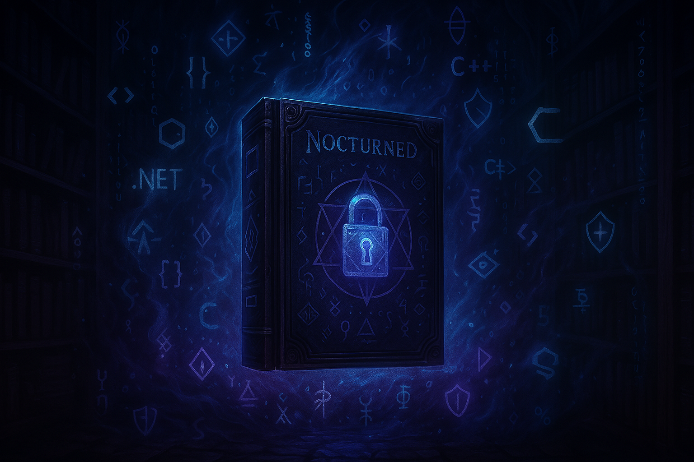

<h1 align="center">
  
</h1>

<p align="center">
  <strong>Modüler, Şifrelenmiş, Lisans Tabanlı Güvenli Launcher Mimarisi</strong><br>
  .NET & WPF teknolojileri ile geliştirilen modern bir kara yazılım framework'ü.
</p>

---

# 🧐 NecronomiconLauncher

> **Unturned için gelişmiş, modüler, lisans kontrollü bir kara yazılım platformu.**  
> EgguWare’in külleri üzerine inşa edilen, modern şifreleme ve uzaktan yönetim altyapısıyla çalışan yeni nesil bir framework.

---

## 🧩 Özellikler

| Kategori           | Açıklama |
|--------------------|----------|
| 🔐 Şifreli Modül Sistemi | `.grim` uzantılı, AES-GCM şifreli modüller yüklenir |
| 🔄 Dinamik Modül Yükleme | Launcher üzerinden modül seçimi ve RAM'e çözüm |
| 🧠 Token + HWID Kontrolü | Lisans doğrulama NodeJS sunucu üzerinden yapılır |
| 💬 Çok Dilli Yapı (Planlı) | `lang/tr.json`, `lang/en.json` destekli sistem |
| 🛠️ Log & Config Yardımcıları | `logs/`, `config.json` ve `LangHelper` sistemleri |
| ⚙️ Web Panel (Planlı) | Adminler için modül, kullanıcı, lisans kontrol arayüzü |
| 🎮 Unturned Entegrasyonu | Gerçek zamanlı cheat tespiti ve modül inject desteği |

---

## 🅾️ Klasik Hile Sistemlerinden Farkı

| Özellik             | Klasik Sistemler | NecronomiconLauncher |
|----------------------|------------------|------------------------|
| DLL Açıklığı         | ❌ Açık & .dll görülür | ✅ AES-GCM şifreli `.grim` dosyalar |
| HWID Kontrol         | ❌ Genellikle yok | ✅ Sunucu tabanlı HWID doğrulama |
| Modül Yönetimi       | ❌ Tüm özellikler tek dosyada | ✅ Modüler `.grim` yapısı ile esnek kullanım |
| Lisans Yönetimi      | ❌ Sabit & açık paylaşım | ✅ Token bazlı, süreli / VIP lisans seçenekleri |
| GUI Uyumluluğu       | ❌ Eski WinForms / Konsol | ✅ WPF ile modern & karanlık tema arayüz |
| Geliştirici Desteği  | ❌ Yok | ✅ Planlı SDK sistemi ile 3. parti grim üretimi |

---

## 🕰️ Yol Haritası

1. ✅ HWID + Token ile giriş  
2. ✅ Nocturned modülü başarıyla çalıştırıldı  
3. ✅ Log sistemi  
4. ✅ Config sistemi  
5. ⏳ LangHelper (dil destek sistemi)  
6. 🛡️ BypassX - anti anticheat modülü  
7. 🌐 Web Panel (admin arayüz)  
8. 🔄 .grim güncelleme & modül mağazası  
9. 📦 Discord/Telegram entegrasyonu  
10. 💀 Kod Kitabı’nın 2. katı: Geliştirici API  

---

## 📸 Ekran Görüntüleri

> 💻 Görseller yakında eklenecek...

---

## 🧙‍♂️ Kimliğimiz

Bu proje bir *gizlilik*, *özgürlük*, *gelişmişlik* ve *zarif karanlık* felsefesine dayanır.  
Klasik hile sistemlerinden uzak, geliştirici dostu ve gizli kod yönetimi ile çalışır.

> **"Kod artık sadece bir araç değil, bir tapınaktır."**

---

## 📜 Lisans

```
Proprietary License - Tüm hakları saklıdır.  
Kod, şifreleme sistemiyle korunmaktadır.  
Yalnızca yetkili kullanıcılar kullanım hakkına sahiptir.
```

> Bu proje halka açık olmasına rağmen, tüm kullanım hakları lisans sahibine aittir.  
> Ticari olmayan denemeler için kısıtlı erişim sağlanabilir.

---

## ✍️ Katkıda Bulun

Proje şu an private olarak geliştirilmektedir.  
Katkıda bulunmak istersen, lütfen bizimle iletişime geçin.  
Yeni modül talepleri, özelleştirme istekleri ve daha fazlası için:  
📧 `valariya@necroclient.dev`

---

### ✅ Yapılacak Son Adımlar

1. `images/nocturned.png` dosyasını GitHub repoya yükle (`images` klasörü oluştur).
2. Bu `README.md` içeriğini ana dizine yerleştir.
3. Commit mesajın şu şekilde olabilir:

```bash
summary: 📘 README.md güncellendi
message: Özellikler, mimari, farklılıklar ve kurumsal kimlik içeriği eklendi.
